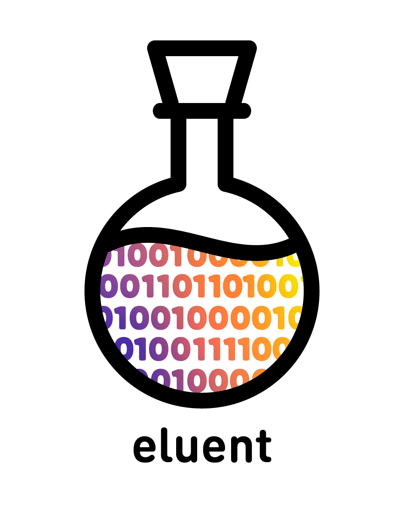

<p align='center'>
    
</p>

# eluent
A tool for conducting hybrid microgenetic analysis with sensor data. Eluent consists of a Python package for data analysis and processing and a Ruby web app interface for post-study qualitative analysis. Eluent accompanies our paper:
> Cesar Torres, Matthew Jörke, Emily Hill, Eric Paulos. [Hybrid Microgenetic Analysis: Using Activity Codebooks toIdentify and Characterize Creative Process](http://www.paulos.net/papers/2019/cc2019.pdf), *Creativity & Cognition 2019*. 


Each JSON file should be structured as
```
{
    "timestamp":            # start of session (Unix time)
    "sampling_rate":        # sensor sampling rate in ms
    "data": [...]           # an array of sensor data sampled @ sampling_rate
}
```
Asynchronously sampled data (e.g. Juptyer notebook events) can alternatively be represented as
```
{
    "data": {           
        "t": [...]          # array of time values (Unix time)
        "y": [...]          # array of sample values
    }                       # --> value y[i] was sampled at time t[i]
}
```

### MTS Matrix Construction
MTS matrix tools are contained in the `MTS` object within the `dataset` module. Properly formatted input data can be automatically read, time-aligned, normalized, and sampled into windows of size *L*. 

```
mts = dataset.MTS(users, 'jupyter')     # construct MTS matrix for juptyer features
L = mts.time2L(8)                       # determine the window size using the sampling frequency
mts.extract_samples(L, normalize=True)  # extract samples and perform per sample normalization
```

* Services (job queues, cache servers, search engines, etc.)

* Deployment instructions

* ...

```
codebook = activity.Codebook(mts)
```

#### (1) Distillation
The distillation phase uses an adaptive greedy centers algorithm to reduce the size of the dataset. The `cull_threshold` ε controls how many samples are discarded at every step; a higher cull threshold produces fewer samples.
```
codebook.distill(cull_threshold=10)
```
After subsampling, the resulting pruned dataset is hierarchically clustered. This operation is computationally intensive: the cull threshold should be set such that approx. 1000 samples are found. 

#### (2) Extraction
The exatraction phase identifies *K* maximially distinctive codewords by pruning the dendrogram at the *K*-th level. 
```
codebook.extract(K=5)
```

#### (3) Application
Finally, the codebook is applied the original MTS matrix, producing a `Chromatogram` object. 
```
chromatogram = codebook.apply()
```

### Chromatogram Analysis

#### Rendering
To generate and visualize the full chromatogram, the chromatogram object must first be *rendered*: rendering applies window smoothing, clusters users based on a given statistic, and recolors the chromatogram based on clustering statistics.
```
chromatogram.render(smoothing_window=3, segment_on='freqs', reorder_colors=True)
```

- `smoothing_window`: controls the kernel size *W* during window smoothing
- `segment_on`: determines which feature vector η users are segmented on
    - `freqs`: codeword frequency vector
    - `logfreqs`: log of codeword frequency vector
    - `markov`: codeword transition matrix
    - `width`: bandwidth mean and standard deviations

#### Statistics & Analysis
The Chromatogram object supports the following methods for codeword analysis. 

| Function Name | Output |
| :--- | :--- |
| `get_length_stats` | dict from codeword number to (mean bandwidth, bandwidth stddev) |
| `get_codeword_length_distribution` | dict from codeword number to raw list of all bandwidth lengths |
| `get_lengths_per_user` | dict from user to dict of raw bandwidth lengths per codeword |
| `get_markov_model` | dict from user to markov transition matrix |
| `get_freqs_per_user` | dict from user to codeword frequency vector | 


### Exporting
The qualitative analysis interface is able to annotate each user's screen capture with the current codeword. To export codeword data for each user, time-tracked VTT (subtitle) files can be generated for each user. 
```
save_path = 'vtt'
prefix = 'jupyter'
dataset.save_subtitles(save_path, chromatogram, prefix)
```

### Visualizations
The following methods are supported:
- `Codebook.visualize()`
- `codebook.visualize_linkage()`
- `Chromatogram.visualize()`
- `Chromatogram.plot_user()`
- `Chromatogram.plot_freq_diff()`
- (in development) `Chromatogram.plot_bandwidth_diff()`
- (in development) `Chromatogram.plot_markov_diff()`

See the Jupyter notebook `example.py` for examples of each visualization method. 

Note that all visualizations use the open source [CMU Bright](https://ctan.org/pkg/cm-unicode?lang=en) font. 

<sub><sup>**Logo Attribution**––Binary Code by Taylan Sentürk, Flask by iconsmind.com from the Noun Project</sup></sub>
